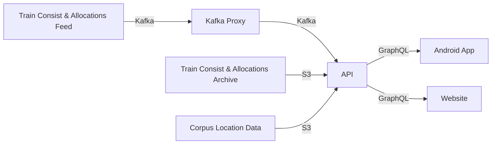

# Train Application Viewer
I promise this diagram is not AI sob


## API/Rust Environment Setup
We use Nix!
1. `nix develop`
2. `Copy and complete .env.example`

# Notes:
## Build updated kotlin sdk version:
```sh
cd packages/sdk
cargo build --release
cargo run --bin uniffi-bindgen generate --library target/release/libsdk.so --language kotlin --out-dir ../../target
```