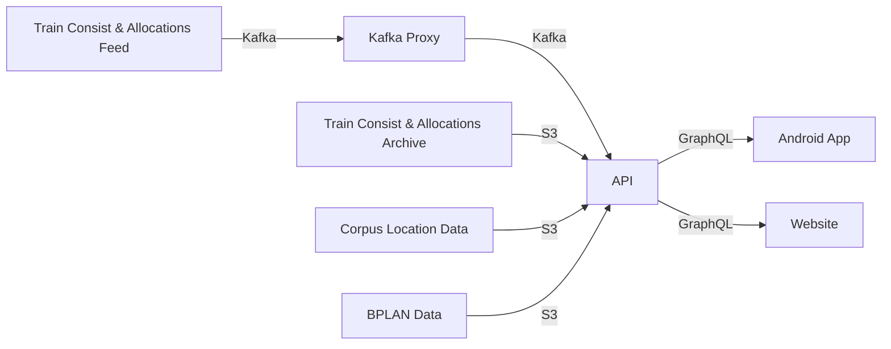

# Train Application Viewer
I promise this diagram is not AI sob


## Datafeeds
This project uses a collection of Datafeeds avaliable on the Rail Data Marketplace. All the sources are free (but their supporting infrastructure isn't)

### Required
- [NWR BPLAN](https://raildata.org.uk/dashboard/dataProduct/P-fd4ea96c-5ff5-4793-b9e2-2a7c842140d3/overview)
- [NWR CORPUS](https://raildata.org.uk/dashboard/dataProduct/P-9d26e657-26be-496b-b669-93b217d45859/overview)
- [NWR Passenger Train Allocation and Consist](https://raildata.org.uk/dashboard/dataProduct/P-3a2ccb58-e1f9-416b-a40e-0614d0269ecf/overview)

### Optional
- [Passenger Train Allocation and Consist archive](https://raildata.org.uk/dashboard/dataProduct/P-fac2476d-e83c-4f71-b49d-2d14b9053ef2/overview) (Needed for historical consist data)

### Needed infrastructure
NWR BPLAN, CORPUS and the Allocation Archive need to be connected to an S3 bucket. The RDM needs an ACL/IAM user and this project needs an IAM/User and an associated access key.

I'm using the following ACL in dev
```json
{
	"Version": "2012-10-17",
	"Statement": [
		{
			"Sid": "VisualEditor0",
			"Effect": "Allow",
			"Action": [
				"s3:GetObject",
				"s3:ListBucket"
			],
			"Resource": [
				"arn:aws:s3:::<BUCKET NAME>",
				"arn:aws:s3:::<BUCKET NAME>/*"
			]
		},
		{
			"Sid": "VisualEditor1",
			"Effect": "Allow",
			"Action": "s3:ListAllMyBuckets",
			"Resource": "*"
		}
	]
}
```
> [!NOTE]
> This is probably not the best possible ACL, but it works for me. Also subsitute `<BUCKET NAME>` with the name of your bucket

You also need to setup a kafkaproxy for each kafka stream (allocations & consist)

## API/Rust Environment Setup
We use Nix!
1. `nix develop`
2. `Copy and complete .env.example`

# Notes:
## Build updated kotlin sdk version:
```sh
cd packages/sdk
cargo build --release
cargo run --bin uniffi-bindgen generate --library target/release/libsdk.so --language kotlin --out-dir ../../target
```